Bali bot eine faszinierende Mischung aus spiritueller Ruhe und tropischer Vielfalt. Die Reise führte über eineinhalb Wochen durch die unterschiedlichsten Regionen der Insel, beginnend im kulturellen Zentrum Ubud mit Einblicken in das Inselinnere. Weitere Stationen waren der beschauliche Hafenort Padang Bai sowie der ruhige Norden rund um Amed. Den Abschluss bildete ein erneuter Aufenthalt in Ubud, von wo aus mein Vater die Heimreise antrat, gefolgt von meinem alleinigen Abstecher nach Nusa Penida. Neben den landschaftlichen Eindrücken war vor allem die Vielfalt der Orte ein absolutes Highlight.

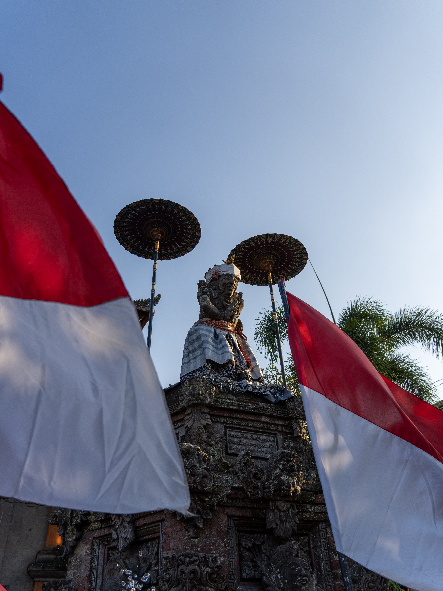
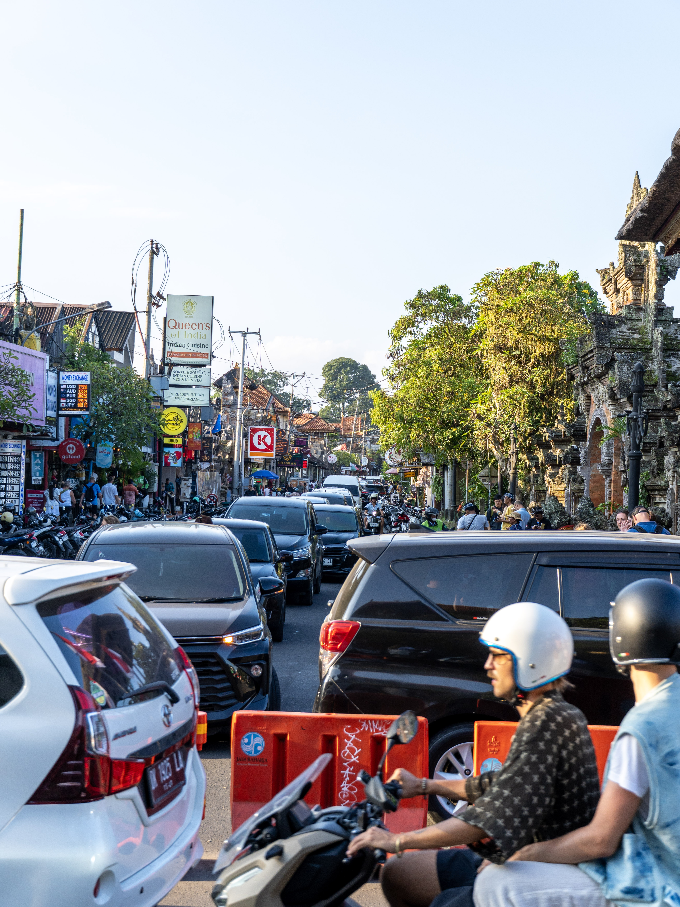
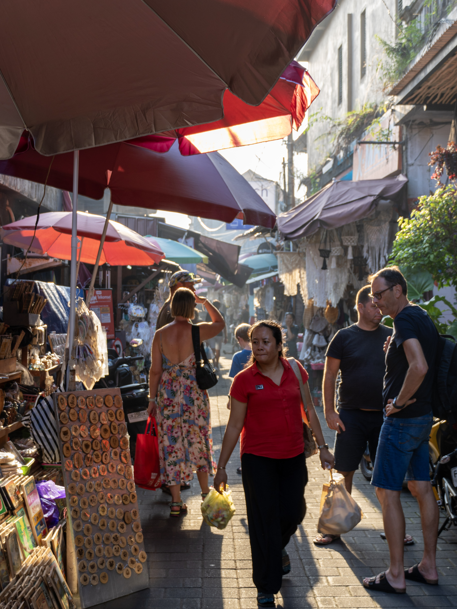
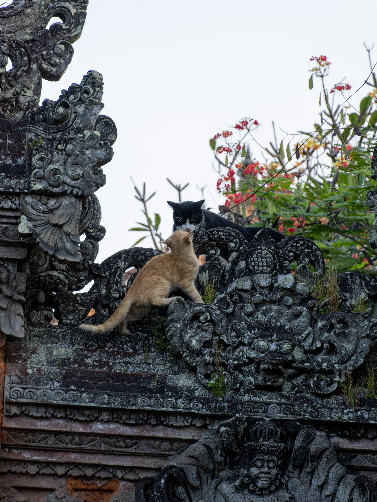
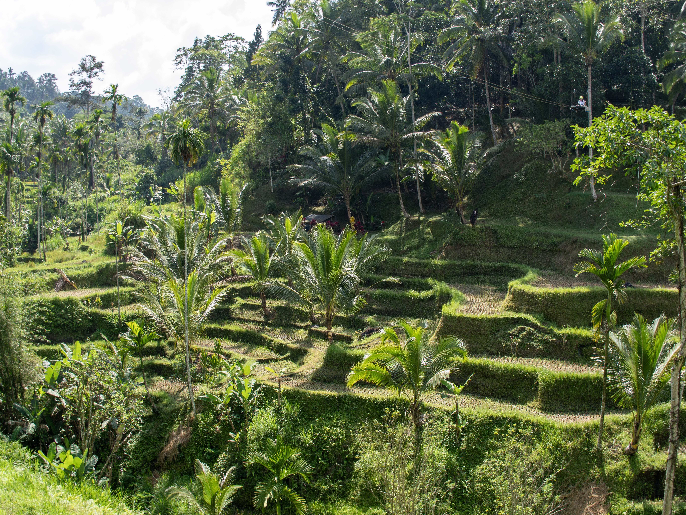
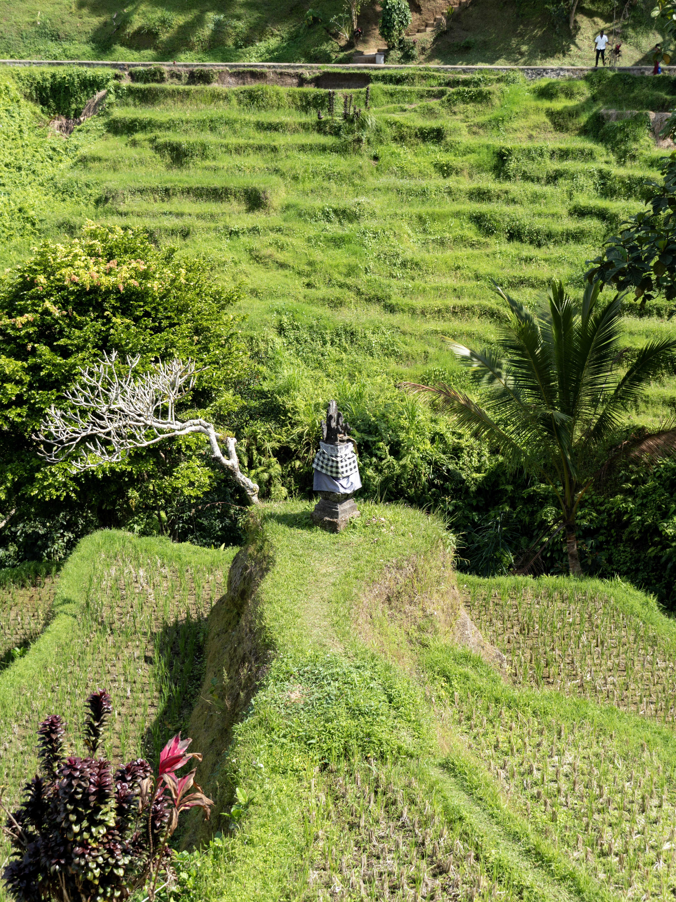
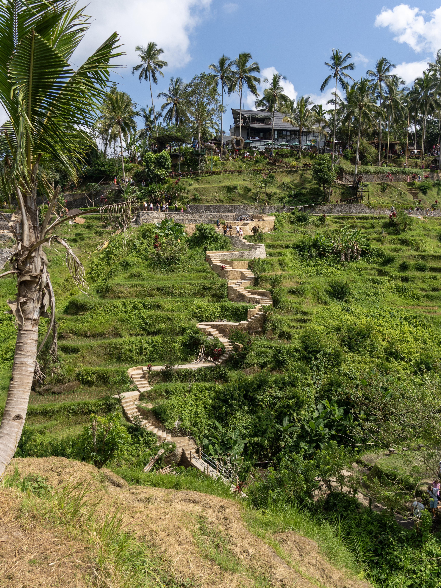
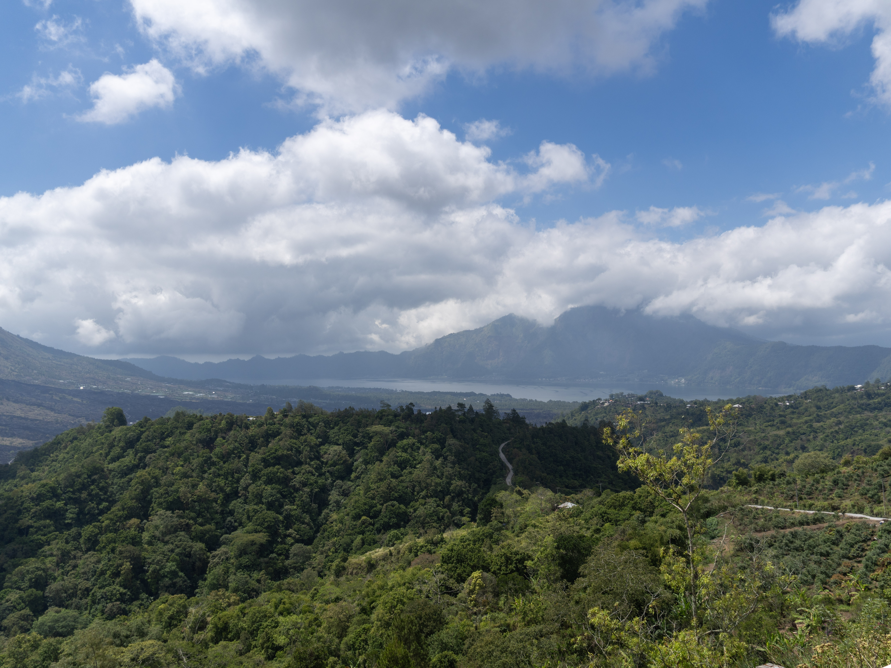
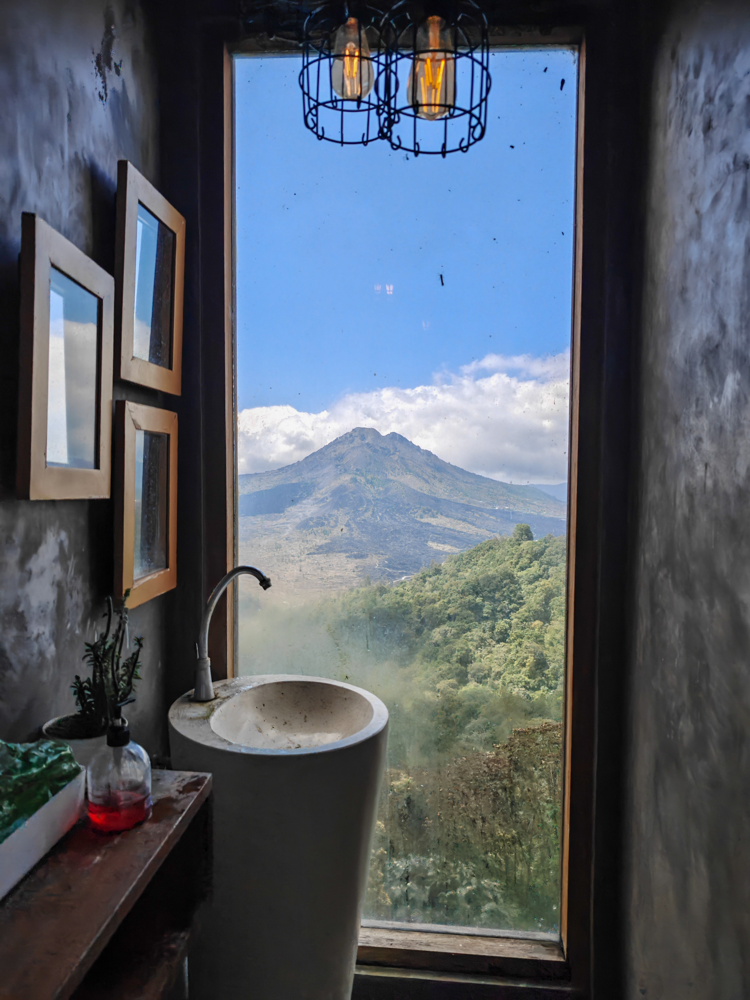
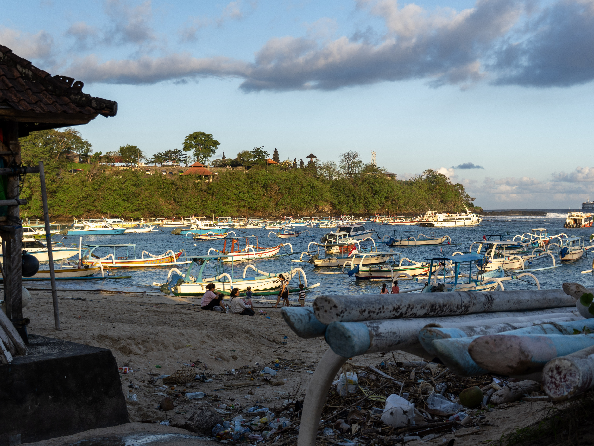
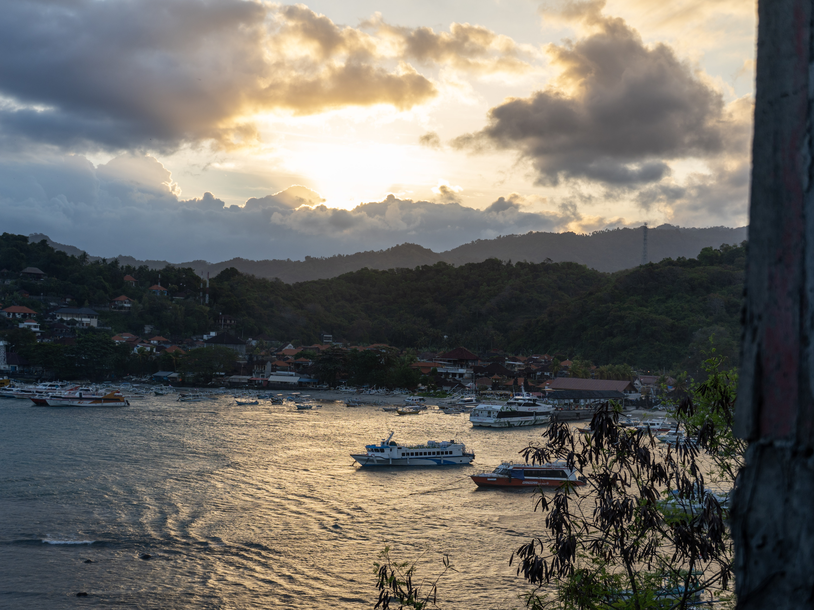
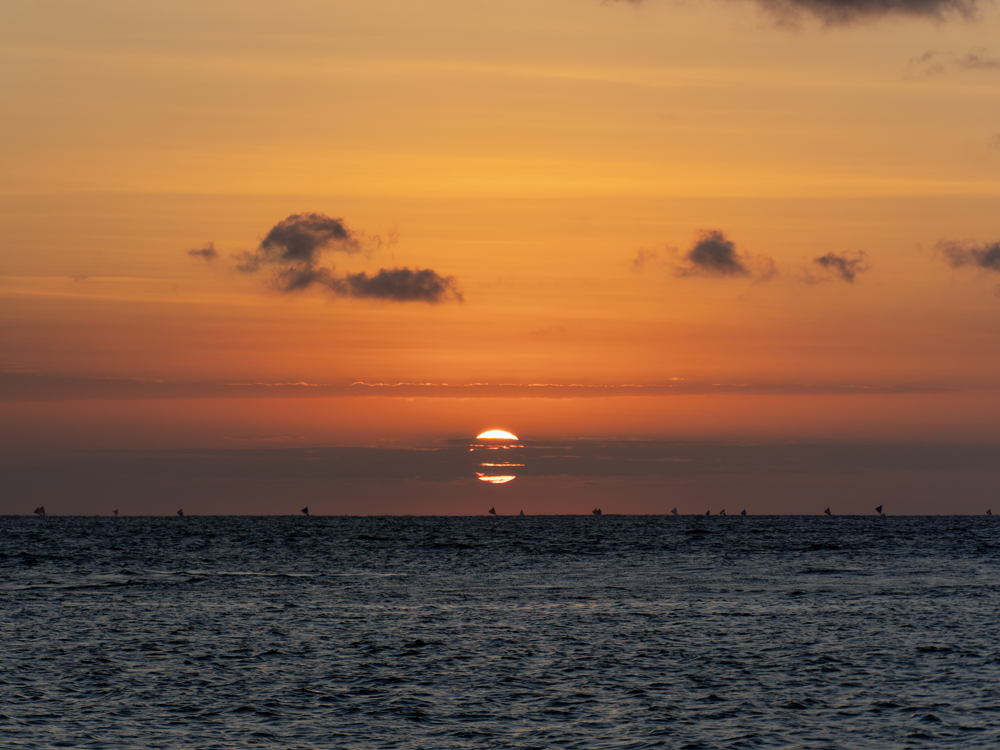
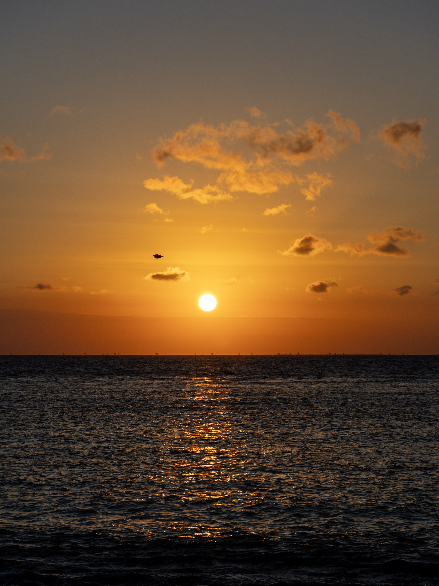
